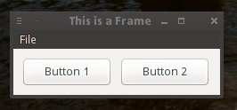

<h4>This project is just an experiment, is incomplete and I have no plans of maintaining it due to time constraints.</h4>

<h1>swxTK</h1>

swxTK is simple to use GUI toolkit for Java. It tries to use the same syntax as that of Swing and use the awesome power of native GUI libraries like GTK, MSW (Windows) and Cocoa (Macintosh) provided by one of my favorite projects,<b> wxWidgets</b>.

To know more about wxWidgets, please visit <a href="http://www.wxwidgets.org">http://www.wxwidgets.org</a>

<h1>How does swxTK work?</h1>
Its fairly simple. The following three components are used:
<ul>
<li>wxWidgets 3.0 (the C++ part)</li>
<li>Java AWT Event Handler (the Java part)</li>
<li>SWIG (Simple Wrapper and Interface Generator, or the communicator.)</li>
</ul>

<h5>The working:</h5>
wxWidgets uses native libraries which can be used to make GUIs through C++. First, a wrapper library is created around the existing wxWidgets library. Then, using SWIG a Java wrapper is generated which can use the wrapper library. Once the Java wrapper is ready, pure Java classes and functions are made manually which call the native functions. 

<h1>Progress Report</h1>

  
This project is still in very early stage. For now (dated 6th of March, 2014) only the following components have been implemented:
<ul>
<li><b>wxApp</b> [PARTIALLY IMPLEMENTED]</li>
→ The current implementation works and the app runs. More functions will be added.  
<li><b>wxFrame</b> [PARTIALLY IMPLEMENTED]</li>
→ wxFrame constants [IMPLEMENTED] 
→ Does not inherit wxWindow on the Java side [WIP] 
→ Resizing the window programmatically [TODO]  

<li><b>wxButton</b> [PARTIALLY IMPLEMENTED]</li>
→ Event Handling [DONE]  
<li><b>wxMenuBar, wxMenu, wxMenuItem</b> [WIP]</li>
→ Event Handling [DONE]  
<li><b>wxDialog</b> [WIP]</li>
  

</ul>
